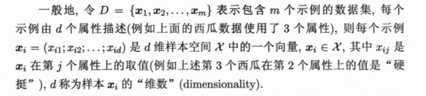
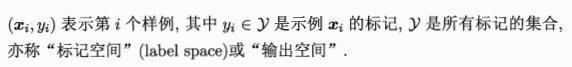
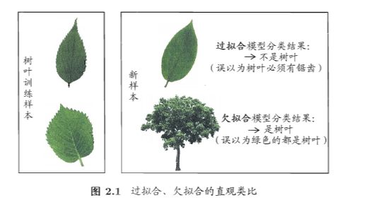
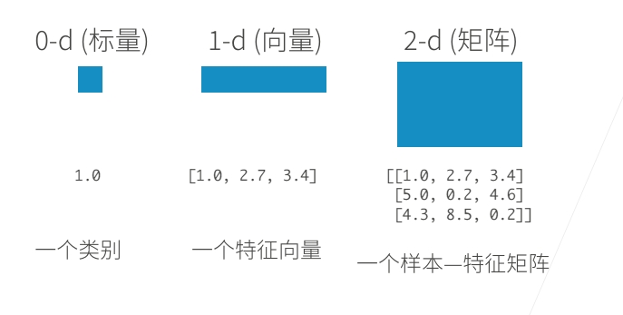
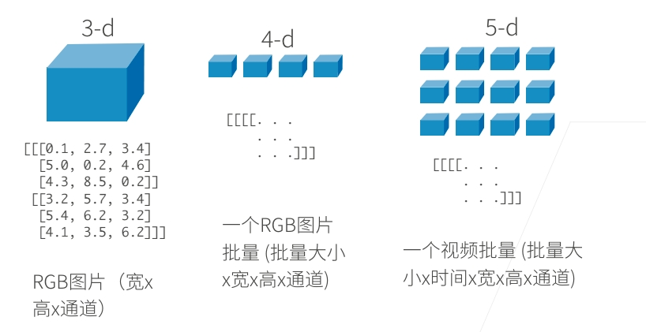
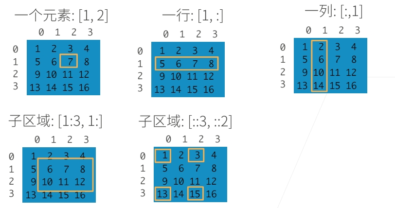

# 基本概念

假定我们收集了一批关于西瓜的数据，例 如（色泽= 青绿；根蒂= 蜷缩；敲声= 浊响），（色泽= 乌黑；根蒂= 稍蜷；敲声=沉 闷），（色泽= 浅白；根蒂= 硬挺；敲声=清脆）。

## 数据

- 这组记录的集合称为一个**“数据集”（data set）**, 其中每条记录是关于一 个事件或对象（这里是一个西瓜）的描述，称 为 一 个 **“示例”（instance）或 “样 本 " （sample）**。
- 反映事件或对象在某方面的表现或性质的事项，例 如 “色泽” “根蒂” “敲 声 " 称 为 **“属 性 "（attribute）或 “特征”（feature）;** 
- 属性上的取 值，例 如 “青绿” " 乌 黑 " 称 为 **“属性值”（attribute value）**
- 属性张成的空 间 称为**“属性空间" （attribute space）、 “样本空间”（sample space）或 “输入 空间”.**例 如 我 们 把 “色泽” “根蒂” “敲声”作为三个坐标轴，则它们张成 一个用于描述西瓜的三维空间，每个西瓜都可在这个空间中找到自己的坐标位 置.
- 由于空间中的每个点对应一个坐标向量，因此我们也把一个示例称为一个 **“特征向量”（feature vector）**. 

## 训练

从数据中学得模型的过程称为“学习”（learning）或 **“训练”（training）**, 这个过程通过执行某个学习算法来完成.

训练过程中使用的数据称为**“训练 数 据 "（training data）**, 

其中每个样本称为一个“训练样本" （training sample）, 训练样本组成的集合称为“训 练 集 "（training set）. 

学得模型对应了关于数据 的某种潜在的规律，因此亦称“假 设 "（hypothesis）; 

这种潜在规律自身,则称 为 “真相”或 “真实”（ground-truth）, 学习过程就是为了找出或逼近真相.

如果希望学得一个能帮助我们判断没剖开的是不是“好瓜”的模型，.要建立这样的关于“预测”（prediction）的 模型，我们需获得训练样本的“结果”信息，例 如 “（（色泽= 青绿;根蒂= 蜷缩; 敲声=浊响），好瓜）”. 这里关于示例结果的信息，例 如 “好瓜”，称 为 **“标 记" （label**）; 拥有了标记信息的示例，则 称 为 **“样 例 "（example）**

一般地，用

## 模型

若我们欲预测的是离散值，例 如 “好瓜” “坏瓜”，此类学习任务称为 “分 类 " (classification).

若欲预测的是连续值，例如西瓜成熟度0.95、0.37, 此 类 学 习 任 务 称 为 “回归”(regression ).

对 只 涉 及 两 个 类 别 的 “二分 类" (binary classifcation)任务，通常称其中一个类为“正类”(positive class), 

另 一 个 类 为 “反 类 ”(negative c la ss);涉 及 多 个 类 别 时 ，则 称 为 “多分 类 " (multi-class classification)任 务 

## 测试

学得模型后，使用其进行预测的过程称为“测试”(testing),被预测的样本 称 为 “测试样本”(testing sample)

我们还可以对西瓜做“聚 类 " (clustering),即将训练集中的西瓜分成若干 组，每组称为一个“簇”(cluster);这些自动形成的簇可能对应一些潜在的概念 划分，例 如 “浅色瓜” “深 色 瓜 "甚 至 “本地瓜” “外地瓜”.需说明 的是，在聚类学习中，“浅色瓜” “本地瓜”这样的概念我们事先是不知道的, 而且学习过程中使用的训练样本通常不拥有标记信息

根据训练数据是否拥有标记信息，学习任务可大致划分为两大类： **“监督 学习“(supervised learning)和 “无 监 督 学 习 "(unsupervised learning)**,分类 和回归是前者的代表,而聚类则是后者的代表. 

学得模型适用于 新样本的能力，称 为 “泛 化 " (generalization)能力.

## 模型评估与选择

通常我们把分类错误的样本数占样本总数的比例称为“错误率”(error rate ),即如果在m 个样本中有a 个样本分类错误，则错误率E = a /m ;相应的, 1 —a /m 称 为 “精度”(accuracy),即 “精度= 1—错误率”.更一般地,我们把 学习器的实际预测输出与样本的真实输出之间的差异称为**“误差”(error),** 学 习 器 在 训 练 集 上 的 误 差 称 为 **“训练误 差 ”(training error)**或 “经验误 差”(empirical e rro r),在 新 样 本 上 的 误 差 称 为 **“泛化误差”(generalization e rro r).**

当学习器把训练样本学得“太好”了的时候，很可能已经把训练样本自身的一些特点当作了所有潜在样本都 会具有的一般性质，这样就会导致泛化性能下降.这种现象在机器学习中称为 **“过拟合" (overfitting)**.与 “过拟合”相对的是**“欠拟合" (imderRtting)**,这 是指对训练样本的一般性质尚未学好.

欠拟合比较容易克服，例如在决策树学习中扩展分支、在神经网络学习中增加训练轮数等，而过拟合则很麻烦.

 

### 评估方法

**留出法** 

“留出法”(hold-out)直接将数据集D划分为两个互斥的集合，其中一个 集合作为训练集S ,另一个作为测试集T , 即 D = S U T, S ∩ T = Φ .在 S 上训 练出模型后，用 T 来评估其测试误差，作为对泛化误差的估计. 常见做法是将大约2/3〜 4/ 5的 样本用于训练，剩余样本用于测试.

**交叉验证法** 

“交叉验证法”(cross validation)先将数据集D 划 分 为 k 个大小相似的 互斥子集， 每个子集 都 尽可能保持数据分布的一致性，然后，每次用 k - 1 个子集的并集作为训练集，余下的那个子集作为测试集；这样就可获得k 组训练/测试集，从而可进行k 次训练和测试，最终返回的是这k 个测试结果 的均值.

# n维数组

N维数组是机器学习和神经网络的主要数据结构。
  
访问数组：
